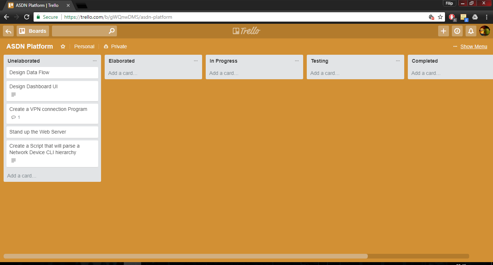
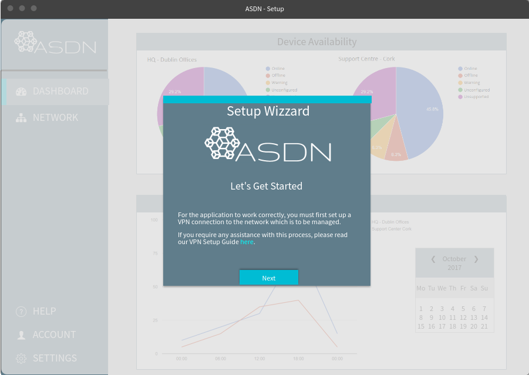
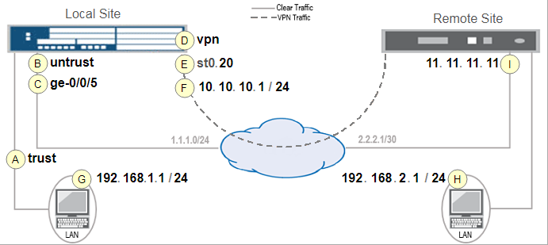
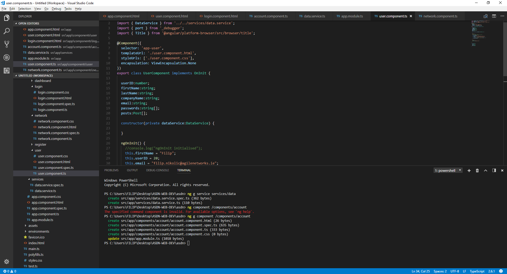
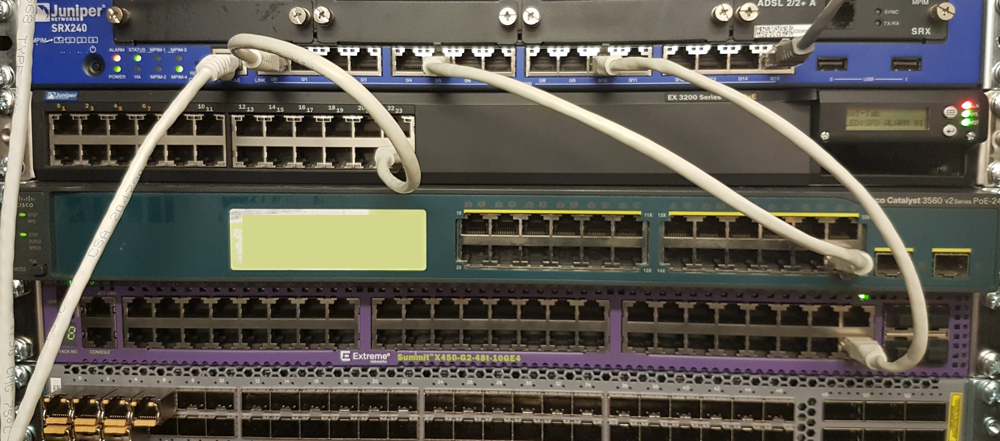
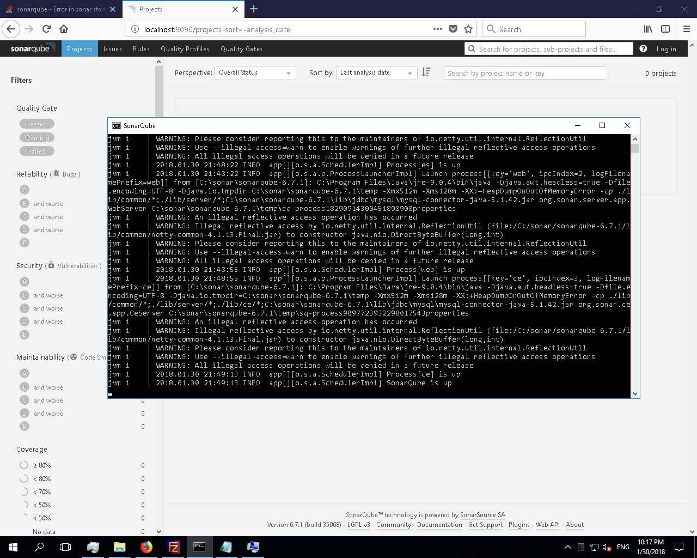
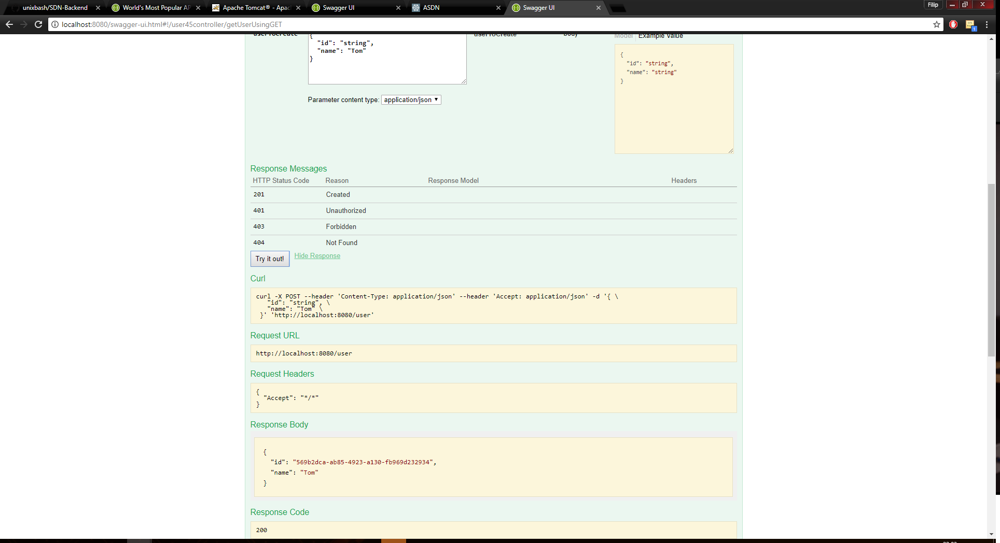
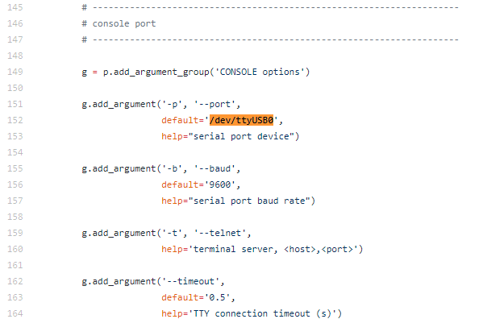
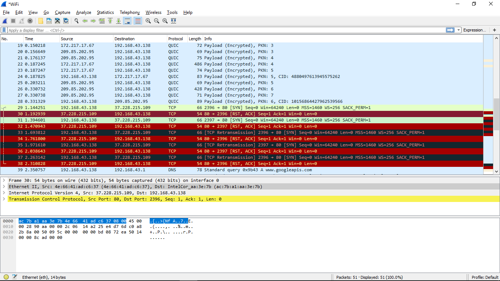
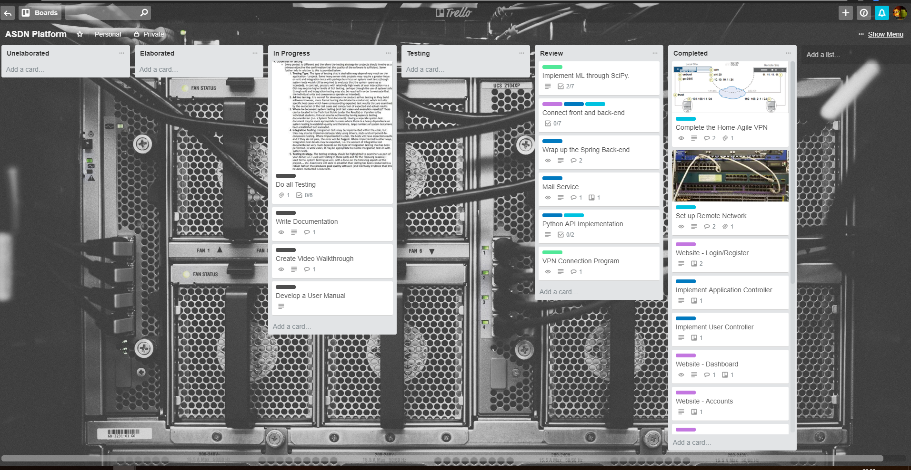

# Automated Software Defined Networking (ASDN) Platform

**Filip Nikolic**

### Initial Project Planning (01/10/17)

This is my first blog entry I will briefly outline the progress I have made thus far:
  - Researched the areas the project will most affect (Computer Networking & Assisted Machine Learning)
  - Met with my potential project supervisor Mr. Brian Stone
  - Developed and submitted my Project Proposal Form
  - Carried out further research on scripting platforms such as Ansible and Puppet
  - Crated a simple System Design Diagram

### Functional Specification Completion (15/10/17) 

I have completed most of my functional specification, with only some diagrams left to be done.
Furthermore these are some additional comments on my progress:
  - I have set up my virtual development environment, by deploying a dell server running ESXi 6.5.
  - On it I have deployed a Windows 2016 Server running Web Services.
  - Remote VPN access has been set up to the server over a Juniper Networks SRX300 Firewall. 
  - I have been regularly meting with my supervisor each week.
  - Currently I have migrated to using trello as a project planning and Scrum Development Platform.

### Application UI Designed (31/10/17)

  - I have completed the design of the responsive Web-UI.  
  - The Functional Specification has been submitted.
  - I am meeting with my supervisor on a weekly basis. 
  - I deployed the Angular front-end platform to the web-server.

    
### Website Deployment (31/10/17)
  - I have deployed an Angular website on the server.
  - The login and registration screens have been created.
  - The site-to-site VPN connection between Agile Networks and my local network have been built.

### Website Development (20/11/17)
  - The website has been mostly developed.
  - It has been developed using Angular 4, Bootstrap and many other dependencies. 
  - As it is still in development, the compiled version of it has not been pushed to GitHub. 

### Reconfiguring the test network (12/12/17)
  - I have had to reconfigure the VPN connection to the test network, as it would not allow some types of traffic through.
  - I have also expanded the lab to include devices from different networks. 
  - The automated VPN build script had to be changed to accommodate the above changes. 

### Website Testing (30/01/18)
  - The website front-end is mostly complete.
  - I have deployed and used the sonarqube test server, and ran some code coverage and unit tests. 
  - Only the final version of website design has been pushed to Git. 

### Core Application Development and Testing (08/02/18)
  - I have changed the platform architecture to run on Tomcat, using Maven as well as Swagger.
  - Integration between the database, front end and is done in Java (using Spring).
  - This process will allow for data to be passed between Angular and Spring (where they are turned into Java Classes).

### Core dependency changes (20/03/18)
  - After extensive research, I have decided to change some of the core dependencies I am using to communicate with the network devices as well as to generate configuration files. Instead of developing my own solution for this problem, I have found a library called [Jinja2](http://jinja.pocoo.org/docs/2.10/), that can be integrated with Ansible. 
  - I have started doing unit tests on some of the complete modules used for generating the device hierarchy. 
  - On the server side, I have moved from a Windows Server 2016 VM to a Ubuntu Server VM. There are a number of reasons for the change, some include a much more lightweight and portable OS, increased default security parameters as well as being able to provide more services, such as being an POP3 or SMTP server. 
  - I have also registered a [domain name](https://asdn.ie) which is secured using an SSL certificate. 

### Fixing Ansible Deployment Issues (31/03/18)
  - After deploying and testing the automation library for Juniper provided by Ansible, I have encountered many know issues and had to fix them during the setup phase. Below are some examples:
  - Deploying a Yaml template file results in "[Errno 2] No such file or directory" - this is fixable by editing the $PATH system variable.
  - After initially connecting to a device, the following appears "unknown host key", which is resolved by changing the default Ansible configuration file, the error occurs, as no device has a local DNS record available.
  - Netconify (a python sub library used by the Juniper Ansible modules) failed, as it was unable to detect a /dev/ttyUSB0 driver, therefore not opening an SSH connection to a device. The fix for this issue took several hours and steps such as rolling back the server VM image to a know good version and downgrading to an older Ansible version, which doesn't require the /dev/ttyUSB0 driver. The developers assumed that every device will have a USB port, however the VM I deployed does not, therefore I found there this was set in the netconify library:
  
  - I have encountered another peculiar error, while testing the network scanner, due to being forced to use Python 2.7 and Python 3.5 for different aspects of the system (Main Application uses 3.5, Ansible requires 2.7). This issue was that none of the pip installed dependencies were usable, therefore, after some research, I found [this](https://stackoverflow.com/questions/2812520/pip-dealing-with-multiple-python-versions) post, helping me solve the issue. 

### Security Features Developed (11/04/18)
  - I have added tokenization to the web-login procedure on Spring. This will allow the user to stay logged for a certain period and will log them out automatically if there is no activity recorded. It also Keeps track of all tokens generated by a single user, allowing for activity tracking. 
  - Additionally, all executed commands will be done by a non-sudo, limited access user, preventing a potential takeover in case of a security breach. This was accomplished using SSH and SFTP, both logging user activity. 
  - I have also developed a password encryption function which complies with Juniper encryption standards and will ease the deployment process of the platform. 
  - Further improvements the network monitoring tool have been made, allowing the system to keep track of every physical interface on the device, as well as many health parameters.
  - I have carried some basic user testing by presenting the core functionality of the platform network engineers in industry. After some testing, I received positive feedback, as well as noticing some bugs in very specific use-cases.
  - Unit tests have been done on Spring and are currently being done on the Python back-end.

### VPN Automation Testing (19/04/18)
  - I have been testing how the VPN generation tool works when deploying different types of VPN configurations. 
  - The testing included a publicly accessible firewall located in a datacentre and one at my house. 
  - Most configuration types worked without any issues, however I was unable to set up a policy based (instead of a route based) configuration. After hours of testing, I decided to limit the functionality and not support this feature. This shouldn't be an issue, as most potential customers would use site-to-site route based VPNs instead. 
  - The below is an image of a WireShark capture, detailing the level at which I was troubleshooting the issue. 
   

### Final Blog Entry (19/05/18)
  - I have developed the project and carried out different forms of testing including user unit, integration, functional as well as user testing.
  - During the testing phase I was able to simulate different network configurations and observer the system behavior. I found that in some extreme cases the automation module would fail to change the device's configuration. To fix this issue, I had to restructure how changes were committed as well as many communication functionality. 
  - Most of the project documentation and the video demo is complete.
   
